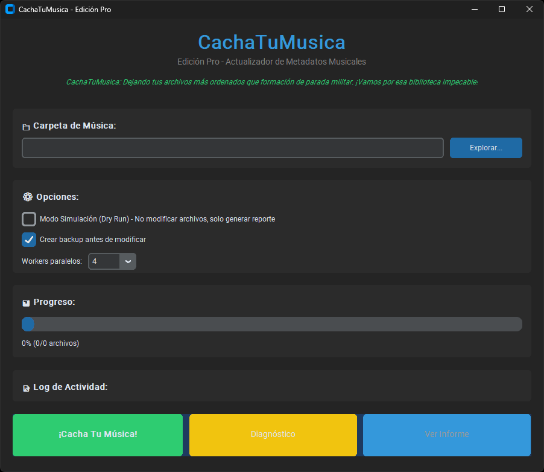

# CachaTuMusica 🎵 — Edición Pro

**CachaTuMusica** es una solución profesional para la organización y optimización de metadatos de bibliotecas musicales. Diseñada para transformar el caos en orden, esta suite combina extracción inteligente basada en rutas, identificación acústica (AcoustID) y potencia de IA (GPT-4) para garantizar que cada canción esté perfectamente etiquetada y nombrada.

> � **Edición Pro**: Máxima precisión, automatización refinada y seguridad total.

---

## ✨ Características Premium



- 🖥️ **Interfaz Vanguardista**: UI optimizada con **CustomTkinter**, diseñada para la eficiencia.
- 🧹 **Edición Ordenaito**: Renombrado automático bajo el estándar estricto `NN - Artista - Título.ext`.
- 🔍 **Prevalidación Diagnóstica**: Escaneo profundo que predice cada cambio antes de que ocurra.
- 🎯 **Audio Fingerprinting**: Tecnología AcoustID para identificación sin errores.
- 🤖 **IA Fallback Engine**: GPT-4o-mini para resolver metadatos desde contextos complejos si el fingerprint falla.
- 📊 **Taxonomía de Casos (A-D)**: Clasificación inteligente para aplicar la acción exacta necesaria.
- 🧪 **Sandbox Real-File**: Suite de pruebas que opera sobre tu biblioteca real en modo simulación (Dry-run).
- �️ **Seguridad Bancaria**: Backups automáticos `.backup_YYMMDD/` y reportes CSV/MD detallados.

---

## 📁 Inteligencia de Rutas (Edición Ordenaito)

La lógica de extracción ha sido refinada para interpretar tu estructura de carpetas de forma humana:

1.  🎹 **Banda / Artista**: Localizado en la carpeta **N-2** (dos niveles arriba del archivo).
2.  💿 **Disco & Año**: Extraídos de la carpeta **N-1** (padre directo). Soporta el patrón `(YYYY) Nombre del Álbum`.
3.  🎵 **Pista & Título**: Parseados dinámicamente desde el nombre del archivo, eliminando el "ruido" de caracteres especiales.

**Estructura Ideal:**
`Musica/Metal/Caliban/(2006) The Undying Darkness/01 - Intro.mp3`

---

## 📊 La Inteligencia Detrás: Los 4 Casos de Clasificación

CachaTuMusica no "adivina", aplica lógica de ingeniería para resolver el estado de cada archivo. Aquí explicamos cómo decide qué hacer:

### 🟢 Caso A: "La Carpeta manda"
*   **Diagnóstico**: El nombre del archivo o su ubicación son perfectos, pero los "Tags" internos están vacíos o dicen "Desconocido".
    - *Ejemplo*: `Caliban/(2006) The Undying Darkness/01 - Intro.mp3` (pero el archivo por dentro no tiene info).
*   **Acción**: El motor extrae la info de la ruta y **escribe los Tags** internos.

### 🔵 Caso B: "Los Tags mandan"
*   **Diagnóstico**: El archivo tiene los metadatos internos (Artista, Título) correctos, pero el nombre del archivo es un desastre.
    - *Ejemplo*: `asdf_123_descarga.mp3` (pero al abrirlo dice "Metallica - Enter Sandman").
*   **Acción**: El motor usa los Tags para **renombrar el archivo** al estándar: `01 - Metallica - Enter Sandman.mp3`.

### 🟡 Caso C: "Búsqueda de Identidad" (Fingerprinting/IA)
*   **Diagnóstico**: Ni el nombre del archivo ni los Tags internos sirven. El archivo es un completo desconocido.
    - *Ejemplo*: `track01.mp3` y sin metadatos.
*   **Acción**: El motor "escucha" el audio (**AcoustID**) o le pregunta a la **IA** para descubrir quién es, y luego **arregla tanto Tags como Nombre**.

### ⚪ Caso D: "Estado Perfecto"
*   **Diagnóstico**: El nombre está ordenado y los Tags coinciden perfectamente.
*   **Acción**: No hace nada. Solo te informa que el archivo está **100% Correcto**. ¡Misión cumplida!

---

## 🚀 Guía de Inicio Rápido

### Instalación
```bash
git clone https://github.com/Iyov/CachaTuMusica.git
cd CachaTuMusica
pip install -r requirements.txt
```

### Uso Recomendado (GUI)
Lanza la interfaz principal para un control total:
```bash
python gui.py
```

### Verificación Segura (Sandbox)
Si querés ver qué haría el motor con tu música actual sin modificar nada:
```bash
python sandbox_test.py
```
*Este comando corre automáticamente en modo **--dry-run** sobre tu carpeta `test/`.*

---

## �️ Stack Tecnológico

- **Core Logic**: `mutagen` (Meta-tagging), `acoustid` (Chromaprint).
- **IA**: `openai` (GPT-4o-mini).
- **GUI**: `customtkinter` & `tkinter`.
- **Reporting**: Reportes CSV compatibles con Excel y reportes Markdown para GitHub.

---

## 📄 Licencia & Créditos

Distribuido bajo la Licencia MIT.
**Innovación impulsada por Iyov.**
*"Vamos a dejar tu música impecable."*
